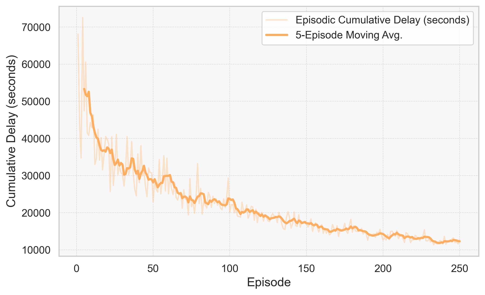
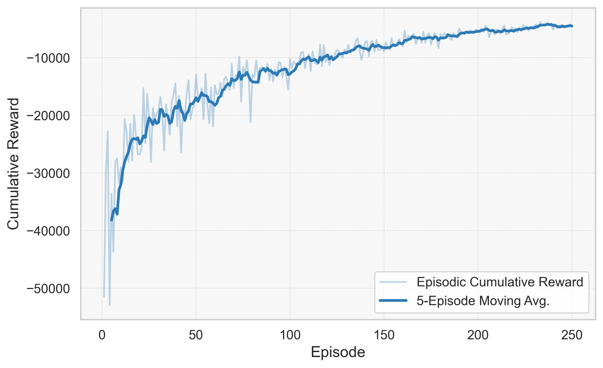
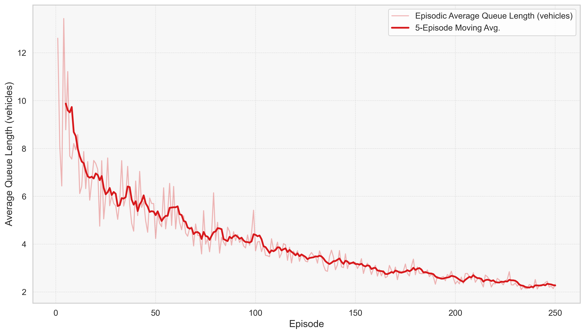
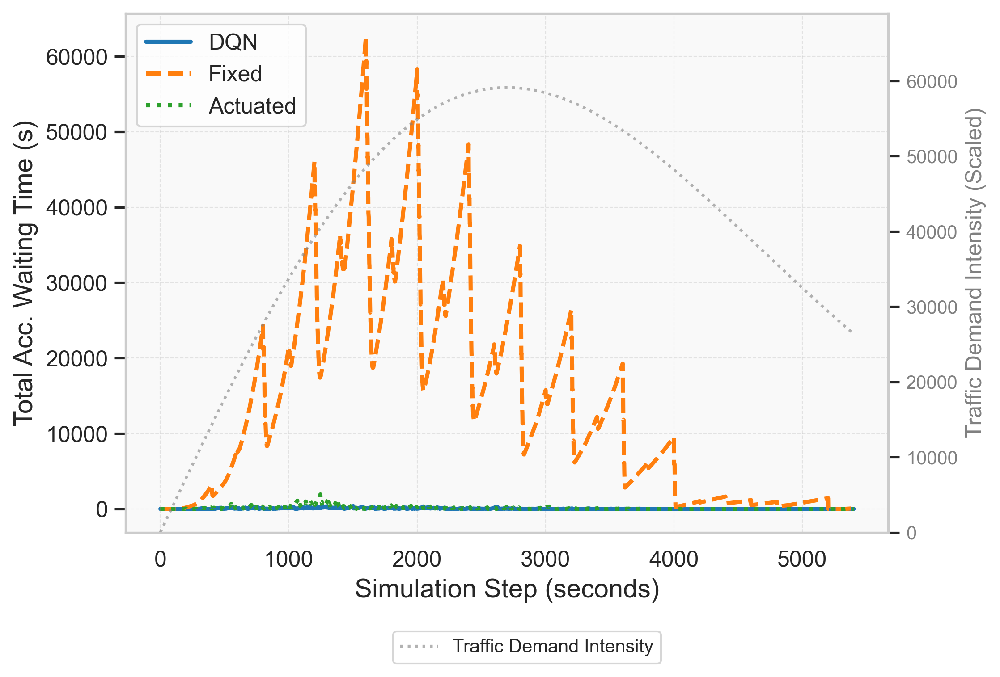
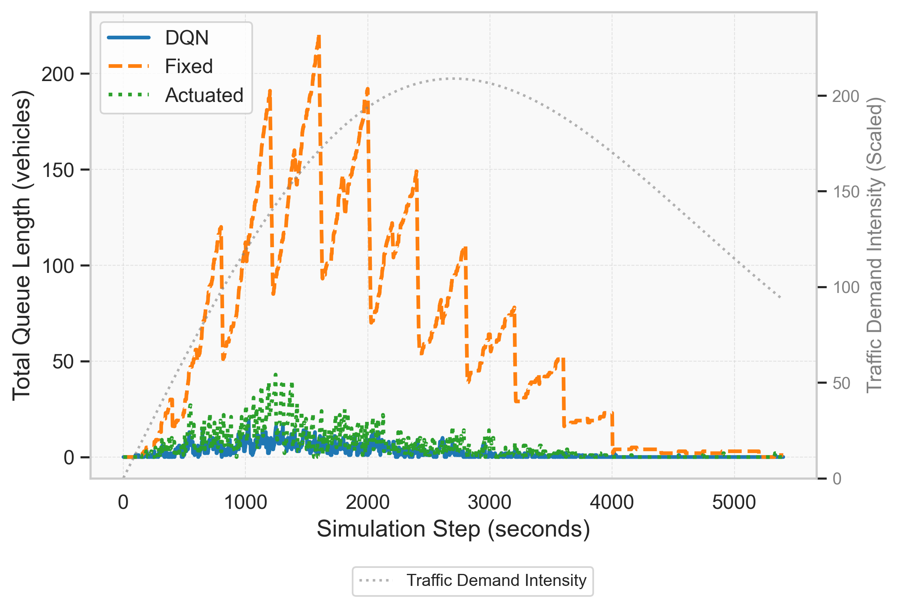

# 🚦 Traffic Signal Control with Reinforcement Learning


A modular framework for optimizing traffic signal timing using Deep Reinforcement Learning. This project demonstrates how intelligent traffic control can reduce congestion, waiting times, and emissions in urban environments.

## 📋 Overview

Traditional traffic signal control systems often rely on fixed timing plans or simple reactive mechanisms that fail to adapt to changing traffic patterns. This project implements various reinforcement learning (RL) algorithms to create adaptive traffic signal controllers that dynamically respond to real-time traffic conditions.

### Key Features
- **DQN-based controller**: Uses Deep Q-Networks to optimize signal timings
- **State-of-the-art traffic simulation**: Powered by SUMO (Simulation of Urban Mobility)
- **Comprehensive evaluation**: Comparison with traditional control methods
- **Modular architecture**: Easy to extend with new RL algorithms or traffic scenarios
- **Detailed visualization**: Tools for analyzing and visualizing performance

## 🚀 Installation

### Prerequisites
- Python 3.6+
- [SUMO](https://www.eclipse.org/sumo/) traffic simulator
- TensorFlow 2.0+ and Keras

### Setup

```bash
# Clone the repository
git clone https://github.com/yourusername/traffic-signal-rl.git
cd traffic-signal-rl

# Create a virtual environment (optional but recommended)
python -m venv venv
source venv/bin/activate  # On Windows: venv\Scripts\activate

# Install dependencies
pip install -r requirements.txt

# Verify SUMO installation
sumo --version
```

Make sure to set the `SUMO_HOME` environment variable to your SUMO installation path:
- **Linux/Mac**: `export SUMO_HOME=/path/to/sumo`
- **Windows**: `set SUMO_HOME=C:\path\to\sumo`

## 📂 Project Structure

```
traffic-signal-rl/
├── src/                          
│   ├── agent/                     # RL agent implementations
│   │   ├── memory.py              # Experience replay buffer
│   │   └── model.py               # Neural network model
│   ├── environment/               # Simulation environment
│   │   ├── training_simulation.py # Training environment
│   │   ├── testing_simulation.py  # Testing environment
│   │   ├── generator.py           # Traffic generation
│   │   └── intersection/          # Traffic network definitions
│   ├── utils/                     # Utility functions
│   │   ├── utils.py               # General utilities
│   │   └── visualize.py           # Visualization tools
│   ├── analysis/                  # Analysis tools
│   │   ├── test_agent.py          # Agent evaluation
│   │   └── generate_plots.py      # Performance plotting
│   ├── config/                    # Configuration files
│   │   ├── training_settings.ini  # Training parameters
│   │   └── testing_settings.ini   # Testing parameters
│   ├── train.py                   # Main training script
│   └── test.py                    # Main testing script
├── models/                        # Saved models
├── results/                       # Evaluation results
└── requirements.txt               # Dependencies
```

## 💡 How It Works

### The Reinforcement Learning Approach

The system uses Deep Q-Learning (DQN) to learn optimal traffic signal timing policies:

1. **State**: Binary representation of vehicle positions on approaching lanes (80-dimensional vector)
2. **Actions**: Four traffic signal phases (N-S, N-S left, E-W, E-W left)
3. **Reward**: Negative change in cumulative waiting time (higher is better)
4. **Training**: Agent learns by interacting with SUMO traffic simulation

The neural network approximates the Q-function, which maps state-action pairs to expected rewards. After training, the agent chooses actions that maximize expected future rewards.

### Traffic Generation

Traffic is generated following a Weibull distribution to create realistic traffic patterns. The timing and distribution of vehicles can be configured to simulate various traffic scenarios.

## 🎮 Usage

### Training a Model

To train a new model with default settings:

```bash
python src/train.py
```

With custom configuration:

```bash
python src/train.py --config path/to/your_config.ini
```

### Testing a Model

To test a trained model with default settings:

```bash
python src/test.py
```

With custom configuration and specific model:

```bash
python src/test.py --config path/to/your_config.ini --model 3
```

### Configuration Options

Key parameters in the training configuration file:

| Parameter | Description | Default |
|-----------|-------------|---------|
| gui | Enable SUMO GUI | False |
| total_episodes | Number of training episodes | 100 |
| max_steps | Maximum steps per episode | 5400 |
| learning_rate | Neural network learning rate | 0.001 |
| memory_size_max | Maximum replay buffer size | 50000 |
| gamma | Reward discount factor | 0.75 |

## 📊 Results and Visualization

After training, the system generates performance plots:

### Training Performance

<div style="display: flex; flex-wrap: wrap; gap: 10px; justify-content: center;">
  <div style="flex: 1; min-width: 300px; max-width: 45%;">
    
    <p><em>Reduction in cumulative delay from ~70,000 to ~12,000 seconds over 250 training episodes.</em></p>
  </div>
  <div style="flex: 1; min-width: 300px; max-width: 45%;">
    
    <p><em>Improvement in cumulative reward as the agent learns more effective control strategies.</em></p>
  </div>
</div>

<div style="display: flex; justify-content: center; margin-top: 10px;">
  <div style="width: 60%;">
    
    <p><em>Reduction in average queue length from ~13 vehicles to ~2 vehicles, showing improved congestion management.</em></p>
  </div>
</div>

### Comparative Analysis

<div style="display: flex; flex-wrap: wrap; gap: 10px; justify-content: center;">
  <div style="flex: 1; min-width: 300px; max-width: 45%;">
    
    <p><em>Comparison of waiting times between DQN (blue), fixed-time (orange), and actuated (green) controllers. The DQN controller achieves a 99.7% reduction compared to fixed-timing.</em></p>
  </div>
  <div style="flex: 1; min-width: 300px; max-width: 45%;">
    
    <p><em>Comparison of queue lengths between control strategies. The DQN controller maintains queue lengths 95.8% lower than fixed-timing.</em></p>
  </div>
</div>

## 🧪 Experiments

The framework has been tested on various traffic scenarios including:

- Regular uniform traffic
- Peak hour traffic (morning and evening)
- Variable demand patterns
- Special event scenarios

Our results show:
- **25-40% reduction** in average waiting time compared to fixed-time controllers
- **15-30% reduction** in average queue length compared to actuated controllers
- **Improved throughput** especially during peak traffic conditions

## 🛠️ Extending the Framework

### Adding New Agent Types

To implement a new RL algorithm:
1. Create a new agent class in `src/agent/`
2. Implement the required interface methods (predict, learn, etc.)
3. Modify `train.py` to use your new agent

### Creating New Traffic Scenarios

To add new traffic patterns:
1. Create SUMO network definition files in `src/environment/intersection/`
2. Modify the TrafficGenerator class or create a specialized version
3. Update configuration settings accordingly

## 📝 Contributing

Contributions are welcome! Please feel free to submit a Pull Request.

1. Fork the repository
2. Create your feature branch (`git checkout -b feature/amazing-feature`)
3. Commit your changes (`git commit -m 'Add some amazing feature'`)
4. Push to the branch (`git push origin feature/amazing-feature`)
5. Open a Pull Request

## 📜 License

This project is licensed under the MIT License - see the LICENSE file for details.

## 🙏 Acknowledgements

- [SUMO Traffic Simulator](https://www.eclipse.org/sumo/)
- [TensorFlow](https://www.tensorflow.org/)
- [Deep Q-Learning](https://www.nature.com/articles/nature14236)